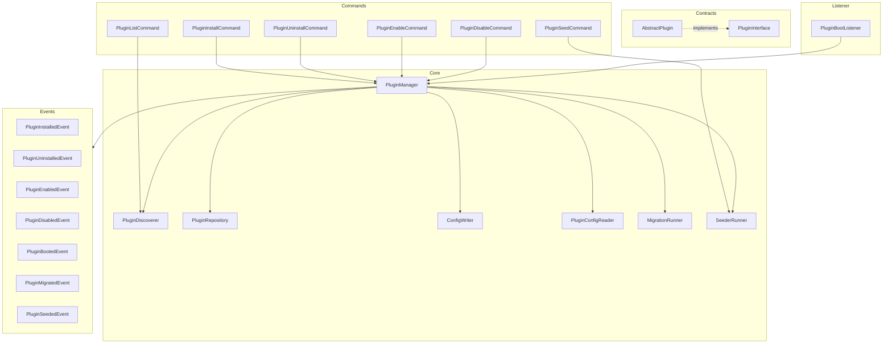

# Design Document: Hyperf Plugin Refactor

## Overview

本设计文档描述了 Hyperf 插件管理包的重构方案。重构目标是建立一个标准化、可扩展、易维护的插件管理系统，支持插件的完整生命周期管理，包括发现、安装、卸载、启用、禁用等操作。

核心设计原则：
- **配置驱动**: 通过 plugin.json 声明插件元数据，简化插件开发
- **接口驱动**: 通过标准接口定义插件规范
- **配置分离**: 安装状态与启用状态分离管理
- **事件驱动**: 通过事件系统解耦组件
- **依赖注入**: 充分利用 Hyperf 的 DI 容器
- **错误容忍**: 单个插件失败不影响其他插件
- **数据迁移**: 支持插件定义数据库迁移和数据填充

## Architecture



## Components and Interfaces

### 1. Plugin.json 配置文件

插件开发者在插件根目录创建 `plugin.json` 文件，声明所有元数据：

```json
{
    "name": "vendor/plugin-name",
    "version": "1.0.0",
    "description": "插件描述",
    "author": "作者名称",
    "priority": 0,
    "dependencies": [
        "vendor/other-plugin"
    ],
    "rollback_on_uninstall": false,
    "enabled": false
}
```

**字段说明：**

| 字段 | 类型 | 必填 | 默认值 | 说明 |
|------|------|------|--------|------|
| name | string | 是 | - | 插件包名，与 composer.json 一致 |
| version | string | 是 | - | 插件版本号 |
| description | string | 否 | "" | 插件描述 |
| author | string | 否 | "" | 插件作者 |
| priority | int | 否 | 0 | 加载优先级，数值越大越先加载 |
| dependencies | array | 否 | [] | 依赖的其他插件包名 |
| rollback_on_uninstall | bool | 否 | false | 卸载时是否回滚数据库迁移 |
| enabled | bool | 否 | false | 安装后是否默认启用 |

**约定目录结构：**

```
vendor/plugin-name/
├── src/
│   └── Plugin.php          # 插件主类，继承 AbstractPlugin
├── Database/
│   ├── Migrations/         # 迁移文件目录（自动检测）
│   │   └── 2024_01_01_000000_create_example_table.php
│   └── Seeders/            # 填充器目录（自动检测）
│       └── ExampleSeeder.php
├── plugin.json             # 插件配置文件
└── composer.json
```

系统会自动检测 `Database/Migrations` 和 `Database/Seeders` 目录，无需在 plugin.json 中配置。

### 2. PluginInterface (Contract)

定义所有插件必须实现的标准接口。简化为只需实现核心生命周期方法。

```php
<?php

namespace SinceLeoo\Plugin\Contract;

interface PluginInterface
{
    /**
     * 获取插件名称 (从 plugin.json 读取)
     */
    public function getName(): string;

    /**
     * 插件安装时调用（在迁移和填充之后）
     */
    public function install(): void;

    /**
     * 插件卸载时调用（在回滚迁移之前）
     */
    public function uninstall(): void;
}
```

### 3. AbstractPlugin (Base Class)

提供插件接口的默认实现，自动从 plugin.json 读取配置。

```php
<?php

namespace SinceLeoo\Plugin\Contract;

abstract class AbstractPlugin implements PluginInterface
{
    protected array $pluginConfig = [];
    protected string $pluginPath = '';

    public function __construct()
    {
        $this->pluginPath = $this->detectPluginPath();
        $this->pluginConfig = $this->loadPluginJson();
    }

    /**
     * 自动检测插件目录路径
     */
    protected function detectPluginPath(): string
    {
        $reflection = new \ReflectionClass(static::class);
        return dirname(dirname($reflection->getFileName())); // src 的上级目录
    }

    /**
     * 从 plugin.json 加载配置
     */
    protected function loadPluginJson(): array
    {
        $jsonPath = $this->pluginPath . '/plugin.json';
        if (file_exists($jsonPath)) {
            return json_decode(file_get_contents($jsonPath), true) ?? [];
        }
        return [];
    }

    public function getName(): string
    {
        return $this->pluginConfig['name'] ?? '';
    }

    public function install(): void
    {
        // 默认空实现，子类可覆盖
    }

    public function uninstall(): void
    {
        // 默认空实现，子类可覆盖
    }

    /**
     * 获取插件根目录路径
     */
    public function getPluginPath(): string
    {
        return $this->pluginPath;
    }

    /**
     * 获取插件配置
     */
    public function getPluginConfig(): array
    {
        return $this->pluginConfig;
    }
}
```


### 3. AbstractPlugin (Base Class)

提供插件接口的默认实现，自动从 plugin.json 读取配置。

```php
<?php

namespace SinceLeoo\Plugin\Contract;

abstract class AbstractPlugin implements PluginInterface
{
    protected array $pluginConfig = [];
    protected string $pluginPath = '';

    public function __construct()
    {
        $this->pluginPath = $this->detectPluginPath();
        $this->pluginConfig = $this->loadPluginJson();
    }

    /**
     * 自动检测插件目录路径
     */
    protected function detectPluginPath(): string
    {
        $reflection = new \ReflectionClass(static::class);
        return dirname($reflection->getFileName());
    }

    /**
     * 从 plugin.json 加载配置
     */
    protected function loadPluginJson(): array
    {
        $jsonPath = $this->pluginPath . '/plugin.json';
        if (file_exists($jsonPath)) {
            return json_decode(file_get_contents($jsonPath), true) ?? [];
        }
        return [];
    }

    public function getName(): string
    {
        return $this->pluginConfig['name'] ?? '';
    }

    public function install(): void
    {
        // 默认空实现，子类可覆盖
    }

    public function uninstall(): void
    {
        // 默认空实现，子类可覆盖
    }

    public function enable(): void
    {
        // 默认空实现，子类可覆盖
    }

    public function disable(): void
    {
        // 默认空实现，子类可覆盖
    }

    public function boot(): void
    {
        // 默认空实现，子类可覆盖
    }
}
```

### 4. PluginConfigReader

负责读取和解析 plugin.json 配置。

```php
<?php

namespace SinceLeoo\Plugin;

interface PluginConfigReaderInterface
{
    /**
     * 读取插件的 plugin.json 配置
     */
    public function read(string $pluginPath): array;

    /**
     * 验证 plugin.json 配置是否有效
     * @return array 验证错误列表，空数组表示验证通过
     */
    public function validate(array $config): array;

    /**
     * 获取配置项，支持默认值
     */
    public function get(array $config, string $key, mixed $default = null): mixed;

    /**
     * 检测插件是否有迁移目录
     */
    public function hasMigrations(string $pluginPath): bool;

    /**
     * 获取迁移目录路径
     */
    public function getMigrationPath(string $pluginPath): ?string;

    /**
     * 检测插件是否有填充器目录
     */
    public function hasSeeders(string $pluginPath): bool;

    /**
     * 获取填充器目录路径
     */
    public function getSeederPath(string $pluginPath): ?string;
}
```

### 5. PluginRepository

管理插件实例的存储和检索。

```php
<?php

namespace SinceLeoo\Plugin;

interface PluginRepositoryInterface
{
    public function register(PluginInterface $plugin): void;
    public function get(string $name): ?PluginInterface;
    public function has(string $name): bool;
    public function all(): array;
    public function getEnabled(): array;
    public function getByPriority(): array;
}
```

### 6. PluginDiscoverer

负责发现和解析插件信息。

```php
<?php

namespace SinceLeoo\Plugin;

interface PluginDiscovererInterface
{
    /**
     * 发现项目 plugins 目录中的插件
     */
    public function discoverLocalPlugins(): array;

    /**
     * 获取已安装的插件列表
     */
    public function getInstalledPlugins(): array;

    /**
     * 检查插件是否已安装
     */
    public function isInstalled(string $packageName): bool;

    /**
     * 检查插件是否已启用
     */
    public function isEnabled(string $packageName): bool;

    /**
     * 获取插件的 ConfigProvider 类名
     */
    public function getPluginConfigProvider(string $packageName): ?string;

    /**
     * 获取插件的 Plugin 类名
     */
    public function getPluginClass(string $packageName): ?string;

    /**
     * 获取插件的 plugin.json 配置
     */
    public function getPluginJsonConfig(string $packageName): array;
}
```

### 7. ConfigWriter

安全地写入配置文件。

```php
<?php

namespace SinceLeoo\Plugin;

interface ConfigWriterInterface
{
    public function updatePluginConfig(string $packageName, array $config): void;
    public function removePluginConfig(string $packageName): void;
    public function setPluginEnabled(string $packageName, bool $enabled): void;
    public function getConfig(): array;
}
```

### 8. PluginManager

核心管理器，协调所有插件操作。

```php
<?php

namespace SinceLeoo\Plugin;

interface PluginManagerInterface
{
    /**
     * 安装插件
     */
    public function install(string $packageName, array $options = []): bool;

    /**
     * 卸载插件
     * @param bool|null $rollback 是否回滚迁移，null 表示使用 plugin.json 配置
     */
    public function uninstall(string $packageName, bool $force = false, ?bool $rollback = null): bool;

    /**
     * 启用插件
     */
    public function enable(string $packageName): bool;

    /**
     * 禁用插件
     */
    public function disable(string $packageName): bool;

    /**
     * 加载所有已启用的插件
     */
    public function bootPlugins(): void;

    /**
     * 获取已加载的插件
     */
    public function getLoadedPlugins(): array;

    /**
     * 检查插件依赖
     */
    public function checkDependencies(string $packageName): array;
}
```


### 9. MigrationRunner

负责执行插件的数据库迁移。

```php
<?php

namespace SinceLeoo\Plugin;

interface MigrationRunnerInterface
{
    /**
     * 执行插件的所有待执行迁移
     */
    public function migrate(string $packageName, string $migrationPath): array;

    /**
     * 回滚插件的所有迁移
     */
    public function rollback(string $packageName, string $migrationPath): array;

    /**
     * 获取插件已执行的迁移列表
     */
    public function getExecutedMigrations(string $packageName): array;

    /**
     * 获取插件待执行的迁移列表
     */
    public function getPendingMigrations(string $packageName, string $migrationPath): array;
}
```

### 10. SeederRunner

负责执行插件的数据填充。

```php
<?php

namespace SinceLeoo\Plugin;

interface SeederRunnerInterface
{
    /**
     * 执行插件填充器目录中的所有填充器
     * @param bool $regenerateProxy 是否在执行前重新生成代理类
     */
    public function seed(string $packageName, string $seederPath, bool $regenerateProxy = true): bool;

    /**
     * 检查填充器是否已执行
     */
    public function hasSeeded(string $packageName): bool;

    /**
     * 重新生成代理类（避免 composer dump -o 后代理类被删除）
     */
    public function regenerateProxyClasses(): void;

    /**
     * 获取填充器目录中的所有填充器类
     */
    public function discoverSeeders(string $seederPath): array;
}
```

## Data Models

### Plugin Configuration Structure

配置文件 `config/autoload/plugins.php` 结构：

```php
<?php

return [
    'plugins_path' => 'plugins',

    'installed' => [
        'vendor/plugin-name' => [
            'version' => '1.0.0',
            'path' => '/path/to/plugin',
            'installed_at' => '2024-01-01 00:00:00',
            'plugin_class' => 'Vendor\\Plugin\\Plugin',
            'migrations_executed' => ['2024_01_01_000000_create_example_table.php'],
            'seeder_executed' => true,
        ],
    ],

    'enabled' => [
        'vendor/plugin-name' => true,
    ],

    'priorities' => [
        'vendor/plugin-name' => 100,
    ],
];
```

### Event Data Structures

```php
class PluginEvent
{
    public function __construct(
        public readonly string $packageName,
        public readonly array $pluginInfo
    ) {}
}

class PluginInstalledEvent extends PluginEvent {}
class PluginUninstalledEvent extends PluginEvent {}
class PluginEnabledEvent extends PluginEvent {}
class PluginDisabledEvent extends PluginEvent {}
class PluginBootedEvent extends PluginEvent {}

class PluginMigratedEvent extends PluginEvent
{
    public function __construct(
        string $packageName,
        array $pluginInfo,
        public readonly array $executedMigrations
    ) {
        parent::__construct($packageName, $pluginInfo);
    }
}

class PluginMigrationRolledBackEvent extends PluginEvent
{
    public function __construct(
        string $packageName,
        array $pluginInfo,
        public readonly array $rolledBackMigrations
    ) {
        parent::__construct($packageName, $pluginInfo);
    }
}

class PluginSeededEvent extends PluginEvent
{
    public function __construct(
        string $packageName,
        array $pluginInfo,
        public readonly string $seederClass
    ) {
        parent::__construct($packageName, $pluginInfo);
    }
}
```

## Correctness Properties

*A property is a characteristic or behavior that should hold true across all valid executions of a system.*

### Property 1: Configuration Round-Trip Consistency

*For any* valid plugin configuration array, writing it to the configuration file and then reading it back SHALL produce an equivalent configuration array.

**Validates: Requirements 2.5**

### Property 2: Configuration Preservation on Update

*For any* existing plugin configuration and any single plugin update operation, all configuration entries not related to the updated plugin SHALL remain unchanged after the update.

**Validates: Requirements 2.6**

### Property 3: Plugin Loading Respects Enabled Status

*For any* set of installed plugins with varying enabled/disabled states, the Plugin_Manager SHALL load exactly those plugins marked as enabled in configuration.

**Validates: Requirements 2.3, 2.4**

### Property 4: New Installations Default to Disabled

*For any* plugin installation operation, the newly installed plugin SHALL have its enabled status set to the value specified in plugin.json (default: false).

**Validates: Requirements 2.2**

### Property 5: Plugin.json Configuration Accuracy

*For any* plugin with a valid plugin.json, the PluginConfigReader SHALL correctly parse all fields and return accurate default values for missing optional fields.

**Validates: Requirements 12.1, 13.1, 14.1**

### Property 6: Migration Execution on Install

*For any* plugin with migrations defined in plugin.json, when the plugin is installed, all pending migrations SHALL be executed and tracked.

**Validates: Requirements 12.2, 12.4, 12.5**

### Property 7: Migration Execution Order

*For any* plugin with multiple migration files, the Migration_Runner SHALL execute them in ascending filename order during installation.

**Validates: Requirements 12.6**

### Property 8: Migration Rollback on Failure

*For any* plugin installation where migration execution fails, all previously executed migrations SHALL be rolled back.

**Validates: Requirements 12.3**

### Property 9: Seeder Execution After Migrations

*For any* plugin with both migrations and seeders defined, the seeder SHALL be executed only after all migrations have completed successfully.

**Validates: Requirements 13.2**

### Property 10: Seeder Failure Non-Blocking

*For any* plugin installation where seeder execution fails, the installation SHALL continue successfully and the error SHALL be logged.

**Validates: Requirements 13.4**

### Property 11: Migration Rollback on Uninstall

*For any* plugin with rollback_on_uninstall set to true in plugin.json, uninstalling the plugin SHALL rollback all plugin migrations in reverse filename order.

**Validates: Requirements 14.2, 14.7**

### Property 12: Database Preservation on Uninstall

*For any* plugin with rollback_on_uninstall set to false (or default), uninstalling the plugin SHALL preserve all database tables.

**Validates: Requirements 14.3**

### Property 13: Priority-Based Loading Order

*For any* set of enabled plugins with different priorities (from plugin.json), the Plugin_Manager SHALL load them in descending priority order.

**Validates: Requirements 8.2, 8.3, 8.4**

### Property 14: Error Isolation During Boot

*For any* set of enabled plugins where one or more plugins throw exceptions during boot, the Plugin_Manager SHALL continue loading the remaining plugins.

**Validates: Requirements 11.1, 11.2, 11.3**


## Error Handling

### Installation Errors

| Error Condition | Handling Strategy |
|----------------|-------------------|
| plugin.json not found | Return error message, no state change |
| Invalid plugin.json | Return validation errors, no state change |
| Missing dependencies | Return dependency list, no state change |
| Migration execution fails | Rollback all executed migrations, abort installation |
| Seeder execution fails | Log warning, continue installation (non-blocking) |

### Runtime Errors

| Error Condition | Handling Strategy |
|----------------|-------------------|
| Plugin boot exception | Log error with stack trace, continue loading others |
| Plugin class doesn't implement interface | Skip plugin, log warning |
| Configuration file corrupted | Use default configuration, log error |

### Uninstallation Errors

| Error Condition | Handling Strategy |
|----------------|-------------------|
| Plugin not installed | Return error message |
| Dependent plugins exist | Return dependent list, block unless forced |
| Migration rollback fails | Display error, ask user whether to force uninstall |

### Migration/Seeder Errors

| Error Condition | Handling Strategy |
|----------------|-------------------|
| Migration file not found | Log warning, skip file |
| Migration syntax error | Rollback executed migrations, return error |
| Seeder class not found | Log warning, mark as not executed |
| Proxy class not found | Regenerate proxy classes, retry once |

## Testing Strategy

### Unit Tests

1. **PluginConfigReader Tests** - 测试 plugin.json 解析和验证
2. **ConfigWriter Tests** - 测试配置文件读写
3. **PluginDiscoverer Tests** - 测试插件发现逻辑
4. **PluginRepository Tests** - 测试插件注册和检索

### Property-Based Tests

使用 PHPUnit DataProvider 进行属性测试，每个属性测试至少运行 100 次迭代。

### Integration Tests

1. **完整安装流程测试** - 包含迁移和填充
2. **完整卸载流程测试** - 包含回滚选项
3. **启用/禁用流程测试**
4. **事件触发测试**

测试框架：PHPUnit 10.x
