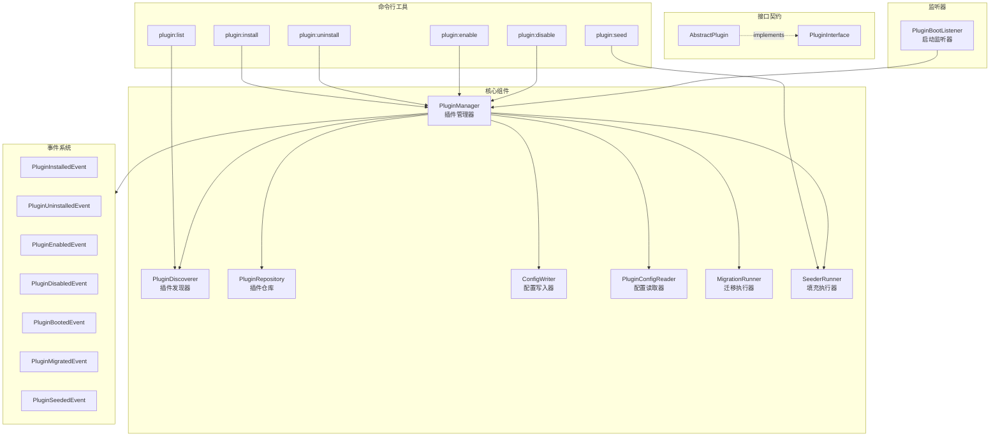

# Hyperf Plugin Manager

[](https://php.net/)
[](https://hyperf.io/)
[](LICENSE)

一个功能强大、易于扩展的 Hyperf 插件管理系统，支持插件的完整生命周期管理，包括发现、安装、卸载、启用、禁用、数据库迁移和数据填充等功能。

## ✨ 特性

- 🚀 **简洁的插件开发体验** - 只需继承 `AbstractPlugin` 并创建 `plugin.json` 即可
- 📦 **配置驱动** - 通过 `plugin.json` 声明插件元数据，无需编写大量 getter 方法
- 🔄 **完整生命周期管理** - 安装、卸载、启用、禁用一站式管理
- 🗃️ **数据库迁移支持** - 自动检测并执行插件的数据库迁移
- 🌱 **数据填充支持** - 支持插件初始数据的自动填充
- 🔗 **依赖管理** - 自动检查插件间的依赖关系
- ⚡ **优先级加载** - 支持按优先级顺序加载插件
- 🛡️ **错误隔离** - 单个插件失败不影响其他插件
- 📡 **事件驱动** - 丰富的生命周期事件，便于扩展
- 🔧 **Hyperf 原生集成** - 支持通过 ConfigProvider 发布配置、注册命令和监听器

## 📐 架构设计



## 📦 安装

```bash
composer require since-leoo/hyperf-plugin
```

发布配置文件：

```bash
php bin/hyperf.php vendor:publish since-leoo/hyperf-plugin
```

## 🚀 快速开始

### 1. 创建插件

在项目的 `plugins` 目录下创建插件：

```
plugins/
└── my-plugin/
    ├── src/
    │   └── Plugin.php
    ├── Database/
    │   ├── Migrations/
    │   │   └── 2024_01_01_000000_create_example_table.php
    │   └── Seeders/
    │       └── ExampleSeeder.php
    ├── plugin.json
    └── composer.json
```

### 2. 配置 plugin.json

```json
{
    "name": "vendor/my-plugin",
    "version": "1.0.0",
    "description": "我的第一个插件",
    "author": "Your Name",
    "priority": 0,
    "dependencies": [],
    "rollback_on_uninstall": false,
    "enabled": false
}
```

### 3. 创建插件主类

```php
<?php

namespace Vendor\MyPlugin;

use SinceLeoo\Plugin\Contract\AbstractPlugin;

class Plugin extends AbstractPlugin
{
    /**
     * 插件安装时调用（在迁移和填充之后）
     */
    public function install(): void
    {
        // 自定义安装逻辑
    }

    /**
     * 插件卸载时调用（在回滚迁移之前）
     */
    public function uninstall(): void
    {
        // 自定义卸载逻辑
    }
}
```

### 4. 安装并启用插件

```bash
# 安装插件
php bin/hyperf.php plugin:install vendor/my-plugin

# 启用插件
php bin/hyperf.php plugin:enable vendor/my-plugin

# 查看插件列表
php bin/hyperf.php plugin:list
```

## 📖 命令行工具

### plugin:install - 安装插件

```bash
php bin/hyperf.php plugin:install <package-name> [options]

# 示例
php bin/hyperf.php plugin:install vendor/my-plugin
php bin/hyperf.php plugin:install vendor/my-plugin --path=./plugins/my-plugin
```

### plugin:uninstall - 卸载插件

```bash
php bin/hyperf.php plugin:uninstall <package-name> [options]

# 选项
--rollback      # 强制回滚数据库迁移
--no-rollback   # 强制不回滚数据库迁移
--force         # 强制卸载（忽略依赖检查）

# 示例
php bin/hyperf.php plugin:uninstall vendor/my-plugin
php bin/hyperf.php plugin:uninstall vendor/my-plugin --rollback
php bin/hyperf.php plugin:uninstall vendor/my-plugin --force
```

### plugin:enable - 启用插件

```bash
php bin/hyperf.php plugin:enable <package-name>

# 示例
php bin/hyperf.php plugin:enable vendor/my-plugin
```

### plugin:disable - 禁用插件

```bash
php bin/hyperf.php plugin:disable <package-name>

# 示例
php bin/hyperf.php plugin:disable vendor/my-plugin
```

### plugin:list - 查看插件列表

```bash
php bin/hyperf.php plugin:list [options]

# 选项
--status=<status>   # 按状态过滤 (installed, enabled, disabled, available)
--json              # 以 JSON 格式输出
-v                  # 详细模式，显示依赖信息

# 示例
php bin/hyperf.php plugin:list
php bin/hyperf.php plugin:list --status=enabled
php bin/hyperf.php plugin:list --json
php bin/hyperf.php plugin:list -v
```

### plugin:seed - 执行插件填充器

```bash
php bin/hyperf.php plugin:seed <package-name>

# 示例
php bin/hyperf.php plugin:seed vendor/my-plugin
```

## 📝 plugin.json 配置说明

| 字段 | 类型 | 必填 | 默认值 | 说明 |
|------|------|------|--------|------|
| `name` | string | ✅ | - | 插件包名，与 composer.json 一致 |
| `version` | string | ✅ | - | 插件版本号 |
| `description` | string | ❌ | `""` | 插件描述 |
| `author` | string | ❌ | `""` | 插件作者 |
| `priority` | int | ❌ | `0` | 加载优先级，数值越大越先加载 |
| `dependencies` | array | ❌ | `[]` | 依赖的其他插件包名 |
| `rollback_on_uninstall` | bool | ❌ | `false` | 卸载时是否回滚数据库迁移 |
| `enabled` | bool | ❌ | `false` | 安装后是否默认启用 |
| `configProvider` | string | ❌ | `null` | 插件的 ConfigProvider 类名（完整命名空间） |

### 完整示例

```json
{
    "name": "vendor/advanced-plugin",
    "version": "2.0.0",
    "description": "一个功能丰富的高级插件",
    "author": "Plugin Developer",
    "priority": 100,
    "dependencies": [
        "vendor/base-plugin",
        "vendor/utils-plugin"
    ],
    "rollback_on_uninstall": true,
    "enabled": true,
    "configProvider": "Vendor\\AdvancedPlugin\\ConfigProvider"
}
```

## 📁 约定目录结构

系统会自动检测以下约定目录，无需在 `plugin.json` 中配置：

```
vendor/plugin-name/
├── src/
│   ├── Plugin.php              # 插件主类，继承 AbstractPlugin
│   └── ConfigProvider.php      # Hyperf 配置提供者（可选）
├── config/                     # 插件配置目录（可选）
│   └── my-plugin.php           # 插件默认配置
├── Database/
│   ├── Migrations/             # 迁移文件目录（自动检测）
│   │   ├── 2024_01_01_000000_create_users_table.php
│   │   └── 2024_01_02_000000_create_posts_table.php
│   └── Seeders/                # 填充器目录（自动检测）
│       ├── UserSeeder.php
│       └── PostSeeder.php
├── publish/                    # 可发布文件目录（可选）
│   └── my-plugin.php           # 待发布的配置文件
├── plugin.json                 # 插件配置文件
└── composer.json
```

## 🎯 使用 ConfigProvider 发布配置

插件可以通过 `ConfigProvider` 来注册命令、监听器、依赖注入和发布配置文件，与 Hyperf 官方组件完全一致。

### 配置方式

有两种方式指定插件的 ConfigProvider：

**方式一：在 plugin.json 中配置（推荐）**

```json
{
    "name": "vendor/my-plugin",
    "version": "1.0.0",
    "configProvider": "Vendor\\MyPlugin\\ConfigProvider"
}
```

**方式二：在 composer.json 中配置（兼容 Hyperf 官方方式）**

```json
{
    "name": "vendor/my-plugin",
    "extra": {
        "hyperf": {
            "config": "Vendor\\MyPlugin\\ConfigProvider"
        }
    }
}
```

> 💡 **优先级**：`plugin.json` 中的 `configProvider` 优先于 `composer.json` 中的配置。

### 创建 ConfigProvider

```php
<?php
// src/ConfigProvider.php

namespace Vendor\MyPlugin;

class ConfigProvider
{
    public function __invoke(): array
    {
        return [
            // 注册命令
            'commands' => [
                Command\MyPluginCommand::class,
            ],
            
            // 注册监听器
            'listeners' => [
                Listener\MyPluginListener::class,
            ],
            
            // 依赖注入绑定
            'dependencies' => [
                Contract\MyServiceInterface::class => Service\MyService::class,
            ],
            
            // 注解扫描路径
            'annotations' => [
                'scan' => [
                    'paths' => [
                        __DIR__,
                    ],
                ],
            ],
            
            // 发布配置文件
            'publish' => [
                [
                    'id' => 'config',
                    'description' => 'My Plugin 配置文件',
                    'source' => __DIR__ . '/../publish/my-plugin.php',
                    'destination' => BASE_PATH . '/config/autoload/my-plugin.php',
                ],
            ],
        ];
    }
}
```

### 发布插件配置

安装插件后，用户可以使用 Hyperf 官方命令发布配置：

```bash
# 发布所有配置
php bin/hyperf.php vendor:publish vendor/my-plugin

# 发布指定 ID 的配置
php bin/hyperf.php vendor:publish vendor/my-plugin --id=config
```

### 完整插件示例

以下是一个功能完整的插件示例：

**目录结构：**

```
plugins/my-awesome-plugin/
├── src/
│   ├── Plugin.php
│   ├── ConfigProvider.php
│   ├── Command/
│   │   └── GreetCommand.php
│   ├── Contract/
│   │   └── GreeterInterface.php
│   ├── Service/
│   │   └── Greeter.php
│   └── Listener/
│       └── BootListener.php
├── publish/
│   └── my-awesome-plugin.php
├── Database/
│   ├── Migrations/
│   │   └── 2024_01_01_000000_create_greetings_table.php
│   └── Seeders/
│       └── GreetingSeeder.php
├── plugin.json
└── composer.json
```

**plugin.json：**

```json
{
    "name": "vendor/my-awesome-plugin",
    "version": "1.0.0",
    "description": "一个功能完整的示例插件",
    "author": "Your Name",
    "priority": 50,
    "dependencies": [],
    "rollback_on_uninstall": false,
    "enabled": false,
    "configProvider": "Vendor\\MyAwesomePlugin\\ConfigProvider"
}
```

**composer.json：**

```json
{
    "name": "vendor/my-awesome-plugin",
    "description": "一个功能完整的示例插件",
    "type": "hyperf-plugin",
    "autoload": {
        "psr-4": {
            "Vendor\\MyAwesomePlugin\\": "src/"
        }
    }
}
```

**src/Plugin.php：**

```php
<?php

namespace Vendor\MyAwesomePlugin;

use SinceLeoo\Plugin\Contract\AbstractPlugin;

class Plugin extends AbstractPlugin
{
    public function install(): void
    {
        // 安装时的自定义逻辑
    }

    public function uninstall(): void
    {
        // 卸载时的清理逻辑
    }
}
```

**src/ConfigProvider.php：**

```php
<?php

namespace Vendor\MyAwesomePlugin;

class ConfigProvider
{
    public function __invoke(): array
    {
        return [
            'commands' => [
                Command\GreetCommand::class,
            ],
            'listeners' => [
                Listener\BootListener::class,
            ],
            'dependencies' => [
                Contract\GreeterInterface::class => Service\Greeter::class,
            ],
            'publish' => [
                [
                    'id' => 'config',
                    'description' => 'My Awesome Plugin 配置文件',
                    'source' => __DIR__ . '/../publish/my-awesome-plugin.php',
                    'destination' => BASE_PATH . '/config/autoload/my-awesome-plugin.php',
                ],
            ],
        ];
    }
}
```

**publish/my-awesome-plugin.php：**

```php
<?php

declare(strict_types=1);

return [
    'greeting_prefix' => 'Hello',
    'enable_logging' => true,
    'cache_ttl' => 3600,
];
```

### ConfigProvider 功能说明

| 配置项 | 说明 | 示例 |
|--------|------|------|
| `commands` | 注册 CLI 命令 | 自定义命令行工具 |
| `listeners` | 注册事件监听器 | 监听系统或插件事件 |
| `dependencies` | 依赖注入绑定 | 接口到实现类的映射 |
| `annotations` | 注解扫描配置 | 自动发现注解类 |
| `publish` | 可发布文件配置 | 配置文件、视图、资源等 |

### 与插件生命周期的集成

当插件被启用时，其 `ConfigProvider` 会被自动加载：

1. **命令自动注册** - 插件的命令会出现在 `php bin/hyperf.php list` 中
2. **监听器自动生效** - 插件的监听器会响应相应事件
3. **依赖注入可用** - 可以在任何地方注入插件提供的服务
4. **配置可发布** - 用户可以通过 `vendor:publish` 发布配置

这种设计让插件开发者可以充分利用 Hyperf 框架的所有特性。

## 🔌 事件系统

插件管理器在生命周期的关键节点会触发事件，你可以监听这些事件来扩展功能：

| 事件 | 触发时机 | 事件数据 |
|------|----------|----------|
| `PluginInstalledEvent` | 插件安装成功后 | packageName, pluginInfo |
| `PluginUninstalledEvent` | 插件卸载成功后 | packageName, pluginInfo |
| `PluginEnabledEvent` | 插件启用后 | packageName, pluginInfo |
| `PluginDisabledEvent` | 插件禁用后 | packageName, pluginInfo |
| `PluginBootedEvent` | 插件启动后 | packageName, pluginInfo |
| `PluginMigratedEvent` | 迁移执行后 | packageName, pluginInfo, executedMigrations |
| `PluginSeededEvent` | 填充执行后 | packageName, pluginInfo, seederClass |

### 监听事件示例

```php
<?php

namespace App\Listener;

use Hyperf\Event\Annotation\Listener;
use Hyperf\Event\Contract\ListenerInterface;
use SinceLeoo\Plugin\Event\PluginInstalledEvent;

#[Listener]
class PluginInstalledListener implements ListenerInterface
{
    public function listen(): array
    {
        return [
            PluginInstalledEvent::class,
        ];
    }

    public function process(object $event): void
    {
        /** @var PluginInstalledEvent $event */
        $packageName = $event->packageName;
        $pluginInfo = $event->pluginInfo;
        
        // 处理插件安装后的逻辑
        // 例如：发送通知、记录日志、初始化缓存等
    }
}
```

## 🔧 扩展开发

### 自定义插件发现器

```php
<?php

namespace App\Plugin;

use SinceLeoo\Plugin\Contract\PluginDiscovererInterface;

class CustomPluginDiscoverer implements PluginDiscovererInterface
{
    // 实现接口方法...
}
```

在 `config/autoload/dependencies.php` 中注册：

```php
return [
    \SinceLeoo\Plugin\Contract\PluginDiscovererInterface::class => \App\Plugin\CustomPluginDiscoverer::class,
];
```

### 自定义迁移执行器

```php
<?php

namespace App\Plugin;

use SinceLeoo\Plugin\Contract\MigrationRunnerInterface;

class CustomMigrationRunner implements MigrationRunnerInterface
{
    // 实现接口方法...
}
```

### 可扩展的接口

| 接口 | 说明 |
|------|------|
| `PluginInterface` | 插件标准接口 |
| `PluginManagerInterface` | 插件管理器接口 |
| `PluginDiscovererInterface` | 插件发现器接口 |
| `PluginRepositoryInterface` | 插件仓库接口 |
| `ConfigWriterInterface` | 配置写入器接口 |
| `PluginConfigReaderInterface` | 配置读取器接口 |
| `MigrationRunnerInterface` | 迁移执行器接口 |
| `SeederRunnerInterface` | 填充执行器接口 |

## ⚙️ 配置文件

配置文件位于 `config/autoload/plugins.php`：

```php
<?php

return [
    // 本地插件目录
    'plugins_path' => 'plugins',

    // 已安装插件（系统自动管理）
    'installed' => [],

    // 插件启用状态（系统自动管理）
    'enabled' => [],

    // 插件加载优先级（从 plugin.json 读取）
    'priorities' => [],
];
```

## 🛡️ 错误处理

### 安装错误

| 错误情况 | 处理策略 |
|----------|----------|
| plugin.json 不存在 | 返回错误信息，不改变状态 |
| plugin.json 无效 | 返回验证错误，不改变状态 |
| 缺少依赖 | 返回依赖列表，不改变状态 |
| 迁移执行失败 | 回滚所有已执行迁移，中止安装 |
| 填充执行失败 | 记录警告，继续安装（非阻塞） |

### 运行时错误

| 错误情况 | 处理策略 |
|----------|----------|
| 插件启动异常 | 记录错误和堆栈，继续加载其他插件 |
| 插件类未实现接口 | 跳过插件，记录警告 |
| 配置文件损坏 | 使用默认配置，记录错误 |

### 卸载错误

| 错误情况 | 处理策略 |
|----------|----------|
| 插件未安装 | 返回错误信息 |
| 存在依赖插件 | 返回依赖列表，阻止卸载（除非强制） |
| 迁移回滚失败 | 显示错误，询问是否强制卸载 |

## 📊 最佳实践

### 1. 合理设置优先级

```json
{
    "priority": 100  // 基础插件设置较高优先级
}
```

### 2. 声明依赖关系

```json
{
    "dependencies": ["vendor/base-plugin"]
}
```

### 3. 谨慎使用 rollback_on_uninstall

```json
{
    "rollback_on_uninstall": false  // 生产环境建议设为 false
}
```

### 4. 迁移文件命名规范

```
YYYY_MM_DD_HHMMSS_description.php
例如：2024_01_15_143000_create_orders_table.php
```

### 5. 使用事件解耦

监听插件事件而不是直接修改插件代码，保持插件的独立性。

## 🧪 测试

运行测试套件：

```bash
# 运行所有测试
composer test

# 运行单元测试
./vendor/bin/phpunit --testsuite=Unit

# 运行属性测试
./vendor/bin/phpunit --testsuite=Property

# 运行集成测试
./vendor/bin/phpunit --testsuite=Integration
```

## 📄 许可证

MIT License

## 🤝 贡献

欢迎提交 Issue 和 Pull Request！

## 📮 联系方式

如有问题或建议，请通过 GitHub Issues 联系我们。
